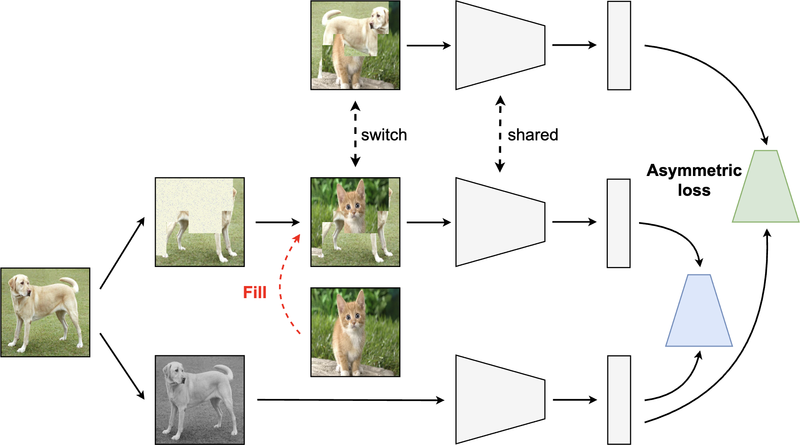

<div align="center">


# [MixMask: Revisiting Masking Strategy for Siamese ConvNets](https://arxiv.org/abs/2210.11456)


[Kirill Vishniakov¹](https://kirill-vish.github.io/), [Eric Xing¹²](http://www.cs.cmu.edu/~epxing/), [Zhiqiang Shen¹](https://zhiqiangshen.com/)

[¹MBZUAI](https://mbzuai.ac.ae/), [²CMU](https://www.cs.cmu.edu/)

<p float="left">
  
  
</p>


</div>

## Overview


<div align=center>

</div>


> **Abstract:** The recent progress in self-supervised learning has successfully combined Masked Image Modeling (MIM) with Siamese Networks, harnessing the strengths of both methodologies. Nonetheless, certain challenges persist when integrating conventional erase-based masking within Siamese ConvNets. Two primary concerns are: (1) The continuous data processing nature of ConvNets, which doesn't allow for the exclusion of non-informative masked regions, leading to reduced training efficiency compared to ViT architecture; (2) The misalignment between erase-based masking and the contrastive-based objective, distinguishing it from the MIM technique. To address these challenges, this work introduces a novel filling-based masking approach, termed MixMask. The proposed method replaces erased areas with content from a different image, effectively countering the information depletion seen in traditional masking methods. Additionally, we unveil an adaptive loss function that captures the semantics of the newly patched views, ensuring seamless integration within the architectural framework. We empirically validate the effectiveness of our approach through comprehensive experiments across various datasets and application scenarios. The findings underscore our framework's enhanced performance in areas such as linear probing, semi-supervised and supervised finetuning, object detection and segmentation. Notably, our method surpasses the MSCN, establishing MixMask as a more advantageous masking solution for Siamese ConvNets.


## 🚀 Pretraining and Linear Probing
You can find the scripts for pretraining and linear evaluation in the `scripts` folder. 
Currently the implementation supports three different regimes of pretraining which can be controlled using the `--method` argument : MixMask branch only -- option `mixmask`; Un-Mix branch only -- option `unmix`; both MixMask and Un-Mix together - option `both`.
To run MixMask training use the following command for pretraining:
```
python main_moco_mixmask.py \
  -a resnet50 \
  --lr $lr \
  --epochs $nepochs \
  --batch-size 256 \
  --dist-url 'tcp://localhost:10001' \
  --multiprocessing-distributed \
  --world-size 1 \
  --rank 0 \
  --mask_lam 0.5 \
  --mask_type block \
  --mlp \
  --moco-t 0.2 \
  --aug-plus \
  --method mixmask \
  --cos \
  --grid_size 8 \
  --exp_path $EXPERIMENT_PATH \
  $DATASET_PATH
```
For linear evaluation please run:
```
python main_lincls.py \
  -a resnet50 \
  --lr 30.0 \
  --batch-size 256 \
  --pretrained $CHECKPOINT_PATH \
  --dist-url 'tcp://localhost:10001' \
  --multiprocessing-distributed \
  --world-size 1 \
  --rank 0 \
  --exp_path $EXPERIMENT_PATH \
  --epochs 100 \
  $DATASET_PATH
```
## 📊 Results
Here we provide the results and checkpoints obtained from pretraining on ImageNet-1K for 200 epochs.

| Model            | Epochs |Result | Checkpoint |
| -----------------|--------|-------| -----      |
| MoCo V2          | 200    | 67.7  |   —        |
| MixMask          | 200    | 69.2  |  [Link](https://drive.google.com/file/d/1nwqjaJ0ubIebzncKlc1-V-6OsQDdzDGE/view?usp=share_link)          |
| Un-Mix + MixMask | 200    | 69.5  |  [Link](https://drive.google.com/file/d/1bHTQIaD3DDFhNOKL6pNQBoim_C_3iSNk/view?usp=share_link)          |

## 📍 Object Detection and Segmentation

Detectron2 config files can be found in the `detection` folder. To prepare your checkpoints to the right format please first convert the checkpoint to Detectron2 format. 
```
python3 convert-pretrain-to-detectron2.py input.pth.tar output.pkl
```

To run the object detection and segmentation evaluation on COCO with 4 GPUs use the following command:

```
python train_net.py --config-file configs/coco_R_50_C4_1x_moco.yaml --num-gpus 4 MODEL.WEIGHTS <PATH-TO-CHECKPOINT>
```

For Pascal VOC 2007 you can use the following command. You may want to run this evaluation several times due to the high variance in the final result.

```
python train_net.py --config-file configs/pascal_voc_R_50_C4_24k_moco.yaml --num-gpus 4 MODEL.WEIGHTS <PATH-TO-CHECKPOINT>
```

## 📜 License 

This project is licensed under MIT license.

## ✍ Citation
```
@misc{vishniakov2023mixmask,
      title={MixMask: Revisiting Masking Strategy for Siamese ConvNets}, 
      author={Kirill Vishniakov and Eric Xing and Zhiqiang Shen},
      year={2023},
      eprint={2210.11456},
      archivePrefix={arXiv},
      primaryClass={cs.CV}
}
```
## 📧 Contact 

For any questions, inqueries and comments, please contact Kirill Vishniakov (ki.vishniakov at gmail.com)

## 👏 Acknowledgements

Our codebase is built upon:

* MoCo V1&V2 (https://github.com/facebookresearch/moco)

* Un-Mix (https://github.com/szq0214/Un-Mix)

* Barlow Twins (https://github.com/facebookresearch/barlowtwins)

